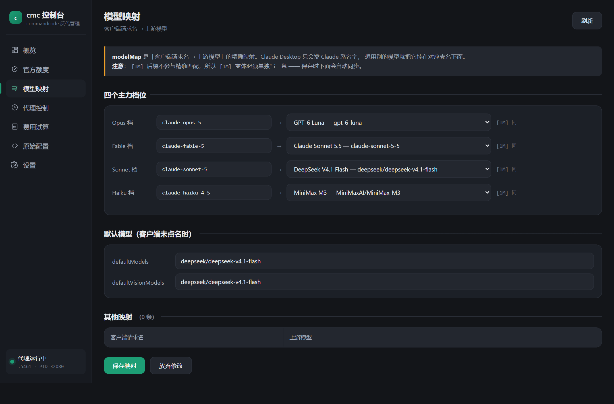

# cmc-proxy-gui

**Command Code GOAT 套餐**的本地反代网关与图形控制台。

本项目将 Command Code 的 Provider API 反代至本机 `127.0.0.1:5411`，使 **Claude Desktop**（自定义推理网关模式）与 **Claude Code** 能够接入 GOAT 套餐；同时提供一个本地网页控制台，用于管理模型映射、查看用量与费用、查询官方额度以及控制代理进程。

仓库已包含反代核心 `proxy.js`，下载后即可直接运行，无需另行获取其他组件。


---

## 背景

Command Code 的 Provider API 按模型族划分三套端点：

| 模型族 | 端点 |
|---|---|
| Claude 系 | `/v1/messages` |
| GPT 系 | `/v1/chat/completions` |
| 其余开源模型 | `/v1/chat/completions` 或 `/v1/responses` |

常见的反代管理工具（例如 CC Switch）中，一个供应商只能绑定一种协议格式，启用其中一种即无法同时服务其余端点；切换供应商之后还需重新建立会话方可生效。

本项目依据模型名称自动路由至对应端点，客户端只需配置单一地址。在此之上，`gui.js` 提供网页控制台，将配置、统计与进程管理集中到同一界面。

---

## 功能

| 页面 | 说明 |
|---|---|
| **概览** | 费用与额度消耗、请求数、输入输出 token、缓存命中率；按日柱状图、按模型汇总、请求明细（含请求模型与实际转发模型） |
| **官方额度** | 查询官方 5 小时 / 周 / 月限额与重置时间，并与本地统计进行同口径对比 |
| **模型映射** | 四个主力档位以下拉框编辑，保存时自动同步 `[1M]` 变体 |
| **代理控制** | 启动与停止、实例归属判定、结构化日志开关、实时输出 |
| **费用试算** | 依据官方牌价即时估算，含分项拆分 |
| **原始配置** | 直接编辑 `config.json` |
| **设置** | 上游地址、API Key、出网代理与端口，无需手动编辑 JSON 文件 |

### 模型映射

四个主力档位（Opus / Fable / Sonnet / Haiku）各自对应一个客户端模型标识，可分别映射至任意上游模型；保存时自动同步 `[1M]` 上下文变体。



### 官方额度的同口径对比

控制台通过以下四个只读接口获取官方数据，查询本身不消耗额度：

| 接口 | 返回内容 |
|---|---|
| `/alpha/whoami` | 账号信息 |
| `/alpha/billing/credits` | 余额，以及 5 小时与周滚动窗口的 `used` / `cap` / `resetAt` |
| `/alpha/billing/subscriptions` | 套餐标识、订阅状态、计费周期起止 |
| `/alpha/usage/summary` | 周期内的费用、请求数与 token 统计 |

上述接口不接受时间区间参数，因此控制台根据 `resetAt` 反推窗口起点（5 小时窗口为 `resetAt − 5h`，周窗口为 `resetAt − 7d`），再将本地 JSONL 日志按同一区间聚合，得到口径一致的两个数值。

实测 5 小时窗口：官方 `0.410252`，本地 `0.410201`，偏差约 `0.02%`，可确认本地依据牌价计算的 `credit` 与官方计费口径一致。覆盖不足的窗口会标注「区间不全，不可比」，避免以不同口径的数值作对比。

---

## 快速开始

### 环境要求

- Node.js ≥ 18（依赖内置 `fetch` 与 `ReadableStream`）
- Windows 可直接使用启动脚本；macOS / Linux 可使用命令行方式启动

### 步骤

**1. 创建配置文件**

复制 `config.example.json` 为 `config.json`，填写 `apiKey`：

```json
{
  "upstream": "https://api.commandcode.ai/provider",
  "apiKey": "user_你的密钥"
}
```

密钥可在 Command Code 账户页面获取，形如 `user_` 开头。

**2. 生成模型牌价**

```bash
node goat-prices.js
```

该步骤生成 `goat-prices.json`，费用统计与费用试算依赖此文件。未执行时控制台仍可正常运行，但费用相关字段为空。

> 若本机需经由代理访问外网，执行前设置 `HTTP_PROXY` 与 `HTTPS_PROXY`，并加上 `NODE_USE_ENV_PROXY=1`（Node 的 `fetch` 默认不读取前两个变量）。控制台自身已内置该处理，此步骤是因为脚本在控制台之外手动执行。

**3. 启动**

```
Windows         双击 start-gui.bat
macOS / Linux   node gui.js --auto-start --open
```

启动后自动打开浏览器并访问 `http://127.0.0.1:5419`。控制台与代理运行在同一进程组内，关闭该窗口即同时停止两者。

> 仅需反代、不需要控制台时：Windows 使用 `start.bat`，macOS / Linux 使用 `./start.sh`。

---

## 目录结构

```
cmc-proxy-gui/
├── proxy.js               # 反代核心：协议转换、模型路由、失败轮换、缓存优化
├── config.example.json    # 配置模板，复制为 config.json 后填写
├── goat-prices.js         # 拉取模型牌价，生成 goat-prices.json
├── gui.js                 # 控制台后端
├── gui.html               # 控制台前端（单文件，无外部依赖）
├── gui.config.json        # 控制台自身配置，首次运行自动生成
├── start-gui.bat          # Windows：启动控制台与代理
├── start.bat              # Windows：仅启动代理
├── start.sh               # macOS / Linux：仅启动代理
├── build.js               # 导出 release 目录
├── schemas.md             # 数据结构与样例参考
├── goat-prices.schema.md  # 牌价文件字段定义
└── docs/                  # 截图
```

---

## 配置

日常配置无需编辑文件，均可在控制台的「设置」页完成：


| 分组 | 配置项 |
|---|---|
| 上游连接 | Base URL、API Key（提供连通性测试） |
| 官方额度 | 启用开关、出网代理（提供连通性测试） |
| 控制台 | 控制台端口、代理端口、侧边栏标题 |

两个测试按钮分别请求 `{upstream}/v1/models` 与 `/alpha/whoami`，便于区分上游与网络问题。

控制台自身的配置项存储于 `gui.config.json`，首次运行自动生成：

```json
{
  "port": 5419,
  "proxy": "",
  "officialApi": true,
  "title": "cmc 控制台"
}
```

其中 `proxy` 为访问官方接口所需的出网代理，留空表示直连。Node 的 `fetch` 默认不读取 `HTTP_PROXY` 环境变量，控制台会在首次请求前注入 `NODE_USE_ENV_PROXY=1` 与 `HTTPS_PROXY`。

上游的 `port`、`upstream`、`apiKey`、`modelMap` 等配置仍位于 `config.json`，控制台仅代为修改。

> 修改端口或代理后需重启控制台方可生效。原因是 Node 的 `fetch` 在首次请求时即固定全局 dispatcher，此后修改环境变量不再起作用。

---

## 接入 Claude Desktop

Claude Desktop 的第三方推理网关模式支持自定义网关地址。打开 **Settings → Connection**：


| 字段 | 取值 |
|---|---|
| Credential kind | `Static API key` |
| Gateway base URL | `http://127.0.0.1:5411`，**结尾不要带 `/v1`**，端点由请求路径决定 |
| Gateway API key | 任意非空值，代理不校验客户端密钥 |
| Gateway auth scheme | `bearer` |

点击 **Test connection**，通过后返回主界面并**新建会话**（已有会话不会重新读取配置）。

### 修改模型显示名称

未配置 Model list 时，Claude Desktop 会读取网关的模型列表，并以 Claude 档位的形式展示上游模型标识，界面所示名称与后端实际模型并不一致。可在 Connection 下方手工添加 Model list 条目加以区分：

| Model ID | Display name | Tier alias |
|---|---|---|
| `claude-opus-5` | `GPT-6 Luna` | `opus` |
| `claude-fable-5` | `Claude Sonnet 5.5` | `fable` |
| `claude-sonnet-5` | `DeepSeek V4.1 Flash` | `sonnet` |
| `claude-haiku-4-5` | `MiniMax M3` | `haiku` |

- **Model ID 需与配置一致**：该标识由代理按 `modelMap` 转发至实际模型，显示名称可自由填写
- **Tier alias** 决定 Claude Desktop 内部将该模型视作哪个档位，影响子任务与快速档的路由
- `Offer 1M-context variant` 按需开启；`Max effort` 仅适用于支持该参数的模型

> 上表所列 Model ID 对应默认映射中的四个档位。若在「模型映射」页调整过映射，此处标识需同步。

Claude Code 与 Codex 使用同一网关地址，配置方式参见上游项目的对应章节。

---

## 安全说明

- 服务仅监听 `127.0.0.1`，不对外网开放
- **明文 API Key 不会下发至浏览器**：`/api/config` 返回的 `apiKey` 始终为掩码形式 `user_****末4位`，回写时识别掩码并保留磁盘原值。因此「原始配置」页显示的是掩码，保存操作不会破坏密钥
- 默认仅允许停止控制台自身启动的代理进程；停止外部实例需显式使用「强制停止」并二次确认
- 写入 `config.json` 前自动备份至 `backups/`

部署或二次开发时，请确认以下条目已加入忽略列表：

```gitignore
config.json          # 含 API Key
gui.config.json
backups/             # 自动备份为 config.json 的完整副本，同样含 API Key
*.jsonl              # 结构化请求日志，含请求内容
proxy.log
```

`backups/` 最易遗漏：仅忽略 `config.json` 并不足够，备份文件中包含完整密钥副本。

---

## 致谢

本项目的反代核心 `proxy.js`，以及其中的协议转换、模型决策、失败轮换与前缀缓存优化等设计，来自开源项目 [cwf818/cmc-proxy](https://github.com/cwf818/cmc-proxy)。感谢原作者的工作。

本仓库在此基础上补充了图形控制台、官方额度查询与用量同口径对比等功能。

## License

[MIT](LICENSE)
