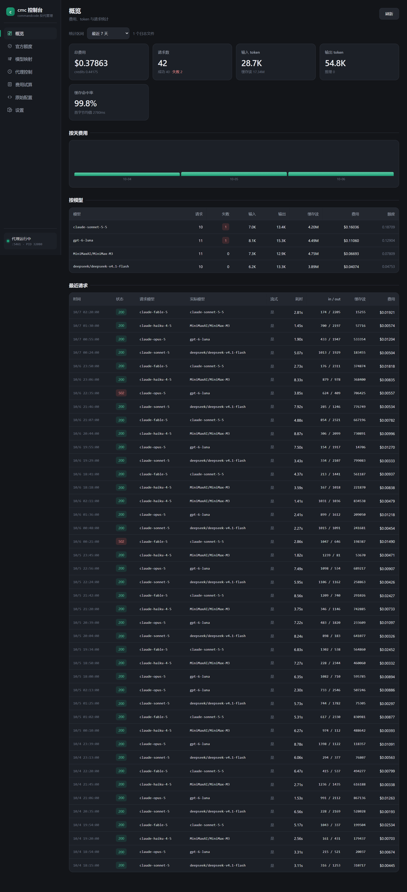
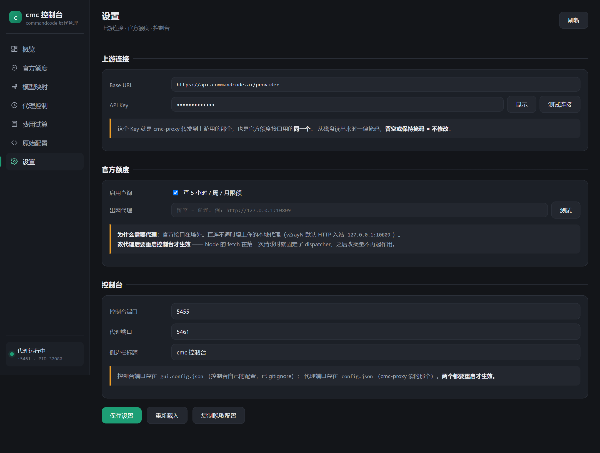
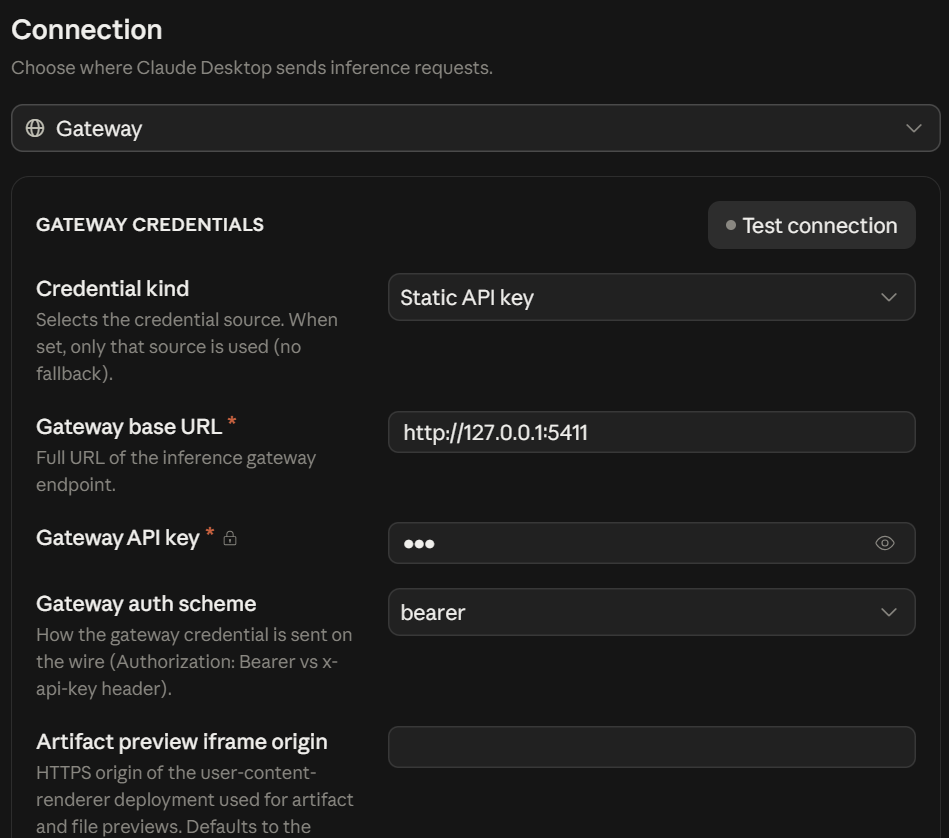

# cmc-proxy-gui

给 [cmc-proxy](https://github.com/cwf818/cmc-proxy) 做的本地网页控制台：模型映射可视化编辑、用量与费用统计、官方额度查询、一键启停。**零依赖**（只用 Node 内置模块 + 单文件 HTML），不修改 `proxy.js` 一行。



---

## 为什么不用 CC Switch

一开始是用 CC Switch 做反代的，但它有个绕不过去的限制：**一个供应商只能绑定一种协议格式**（OpenAI Chat / OpenAI Responses / Anthropic 三选一），端点由「接口格式」决定，**不由模型决定**。

而 commandcode 的 Provider API 正好是**按模型族分三套 URL** 的：

| 模型族 | 端点 |
|---|---|
| Claude 系 | `/v1/messages` |
| GPT 系 | `/v1/chat/completions` |
| 其它 OSS 模型 | `/v1/chat/completions` 或 `/v1/responses` |

想在一个客户端里混着用，就得在 CC Switch 里来回切供应商；更麻烦的是切完还要去 Claude Desktop 新建会话才生效，切错一次要排查半天。

[cmc-proxy](https://github.com/cwf818/cmc-proxy) 把这个问题从根上解决了 —— 它按模型名自动路由到对应端点，一个地址就够。但它本身只有命令行和日志：改模型映射要手编 JSON，看用量要翻日志，查额度得敲 curl。

**所以有了这个控制台**：把映射、用量、额度、启停都搬到网页上，`proxy.js` 一个字不动。

---

## 功能

| 页面 | 做什么 |
|---|---|
| **概览** | 费用 / credits / 请求数 / 输入输出 token / 缓存命中率 · 按天柱状图 · 按模型汇总 · 最近请求明细（含「请求模型 → 实际转发模型」） |
| **官方额度** | 直连官方 alpha 接口，看 **5 小时 / 周 / 月** 限额与重置倒计时，并与本地统计做**同口径对比** |
| **模型映射** | 四个主力档位一栏一个下拉，保存时自动同步 `[1M]` 变体 |
| **代理控制** | 启停 / 归属判定 / jsonlLog 一键开关 / 实时输出 |
| **费用试算** | 按官方牌价即时估算，带分项拆分 |
| **原始配置** | 直接编辑 `config.json` |
| **设置** | 上游 URL、API Key、出网代理、端口 —— 不用再手改 JSON |

### 官方额度怎么做到和本地同口径

用到四个**只读 GET、查询不消耗额度**的官方接口：

```
/alpha/whoami                  账号
/alpha/billing/credits         余额 + 5 小时 / 周滚动窗口（used / cap / resetAt）
/alpha/billing/subscriptions   套餐 id / 状态 / 计费周期起止
/alpha/usage/summary           周期内费用 / 请求数 / token
```

它们**不接受时间区间参数**，所以控制台反过来用 `resetAt` 推出窗口起点（5 小时窗口 = `resetAt − 5h`），再把本地 JSONL 日志按**同一区间**切，算出真正可比的两个数。

实测 5 小时窗口：官方 `0.410252` vs 本地 `0.410201`，**差 0.02%** —— 说明本地按牌价算出的 `credit` 和官方计费是同一把尺子。覆盖不足的窗口会标「区间不全，不可比」，不会拿两个不同口径的数字骗人。

---

## 安装

控制台只是界面，**代理本体是 cmc-proxy**，所以两者要放在同一个目录。

**1. 先准备好 cmc-proxy**

按 [cmc-proxy 的 README](https://github.com/cwf818/cmc-proxy) 装好并跑通，目录里应该有 `proxy.js` 和 `config.json`。

**2. 把本仓库的文件复制进去**

把 `gui.js`、`gui.html`、`start-gui.bat` 复制到 cmc-proxy 目录里。

**3. 双击 `start-gui.bat`**

会**在一个窗口里**把控制台和代理一起拉起来，然后自动打开浏览器到 `http://127.0.0.1:5419`。关掉那个窗口 = 全部停止。

> 只在 Windows 上验证过。macOS / Linux 直接 `node gui.js --auto-start --open` 效果一样。
>
> 第一次跑之前建议先执行一次 `node goat-prices.js`（cmc-proxy 自带），
> 否则「费用试算」和用量里的费用列会没有牌价数据。

---

## 配置

**日常不需要改任何文件** —— 全部在「设置」页里改：



| 组 | 字段 |
|---|---|
| **上游连接** | Base URL、API Key（带「测试连接」） |
| **官方额度** | 启用开关、出网代理（带「测试」） |
| **控制台** | 控制台端口、代理端口、侧边栏标题 |

两个「测试」按钮打的是不同接口，可以分开排查：上游那个测 `{upstream}/v1/models`，官方额度那个测 `/alpha/whoami`。

控制台自己只有 4 个配置项，存在 `gui.config.json`（首次运行自动生成）：

```json
{
  "port": 5419,          // 控制台端口
  "proxy": "",           // 出网代理，例：http://127.0.0.1:10809；空 = 直连
  "officialApi": true,   // 是否启用官方额度查询
  "title": "cmc 控制台"   // 侧边栏标题
}
```

> 上游的 `port` / `upstream` / `apiKey` / `modelMap` 等仍在 `config.json` 里（cmc-proxy 读的那个），控制台只是帮你改它。
>
> **改端口或代理后要重启控制台** —— Node 的 `fetch` 在第一次请求时就固定了 dispatcher，之后改变量不再起作用。
>
> 出网代理是为了访问官方额度接口（在境外）。Node 的 `fetch` 默认不读 `HTTP_PROXY`，
> 控制台会在第一次请求前替你注入 `NODE_USE_ENV_PROXY=1` + `HTTPS_PROXY`，所以不配也能用于纯转发。

---

## 接入 Claude Desktop

Claude Desktop 的 3P 模式支持自定义推理网关。打开 **Settings → Connection**：



| 字段 | 填什么 |
|---|---|
| Credential kind | `Static API key` |
| Gateway base URL | `http://127.0.0.1:5411` —— **不要带 `/v1`**，端点由请求路径决定 |
| Gateway API key | **任意非空值** —— cmc-proxy 不校验客户端密钥 |
| Gateway auth scheme | `bearer` |

点 **Test connection**，通过后回主界面**开一个新会话**（旧会话不会重读配置）。

### 顺手把模型名改成看得懂的

不填 Model list 时，Claude Desktop 会去拉网关的模型列表，把上游 ID 套上 Claude 的档位壳显示 —— 界面上写着「Sonnet 5.5」，后端实际跑的可能根本不是 Sonnet。**在 Connection 下面手工加几条 Model list** 就能把名字改成真实后端名：

| Model ID | Display name | Tier alias |
|---|---|---|
| `claude-opus-5` | `GPT-6 Luna` | `opus` |
| `claude-fable-5` | `Claude Sonnet 5.5` | `fable` |
| `claude-sonnet-5` | `DeepSeek V4.1 Flash` | `sonnet` |
| `claude-haiku-4-5` | `MiniMax M3` | `haiku` |

- **Model ID 必须照抄** —— 它是给 cmc-proxy 的壳名，cmc 会按 `modelMap` 把它转成真实模型；显示名随你写
- **Tier alias** 决定 Claude Desktop 内部把这个模型当哪个档位用（影响子任务和快速档的路由）
- `Offer 1M-context variant` 按需开；`Max effort` 留给支持该参数的模型，DeepSeek 系不认

> 上表的 ID 是 cmc-proxy 默认映射里已有的四个。你在「模型映射」页改过映射的话，ID 要跟着对上。
>
> Claude Code / Codex 接入用的是同一个网关地址，见 cmc-proxy README 的对应章节。

---

## 安全

- **只监听 `127.0.0.1`**，不上局域网
- **明文 API Key 不下发到浏览器**：`/api/config` 返回的 `apiKey` 一律是掩码 `user_****末4位`（保留末 4 位只为便于辨认「换没换 Key」），回写时识别掩码并保留磁盘原值 —— 所以「原始配置」页看到的是掩码，保存也不会把 Key 写坏
- **不会误杀**：默认只能停止「控制台自己启动的」代理；要停外部实例得点「强制停止」（有二次确认）
- **写 `config.json` 前自动备份**到 `backups/`

⚠️ **自己维护 `.gitignore` 时别忘了这几条**：

```gitignore
config.json        # 含 apiKey
gui.config.json
backups/           # 自动备份里是 config.json 的完整副本，同样含 apiKey
*.jsonl            # 结构化请求日志，含你的请求内容
proxy.log
```

`backups/` 这条最容易漏：只忽略 `config.json` 是不够的，备份文件里是**带完整 Key 的副本**。

---

## 致谢

反代核心 `proxy.js`、协议自动路由、模型决策、缓存优化都来自
[cwf818/cmc-proxy](https://github.com/cwf818/cmc-proxy)，感谢原作者把坑都趟平了。
本仓库只做界面这一层。

## License

[MIT](LICENSE)
